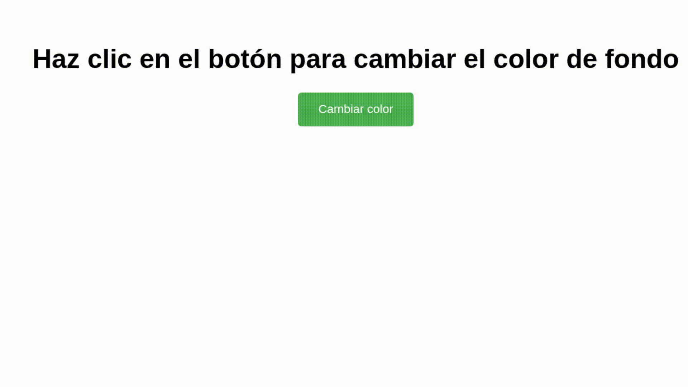
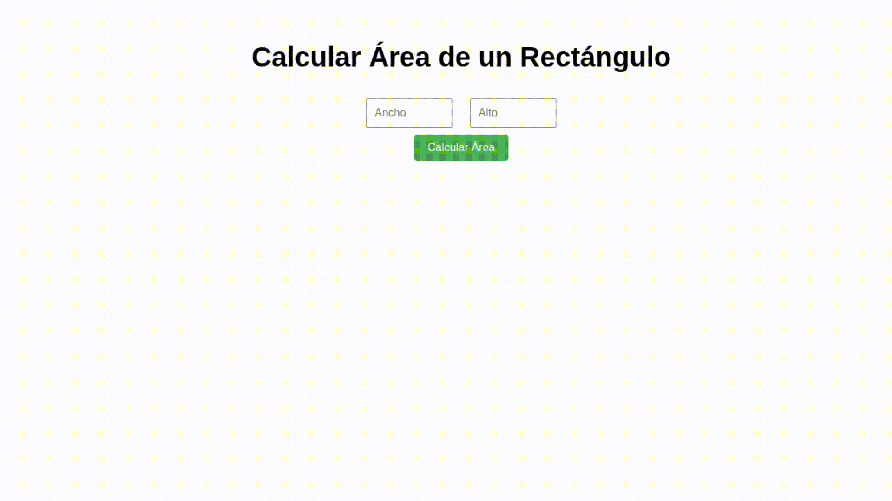
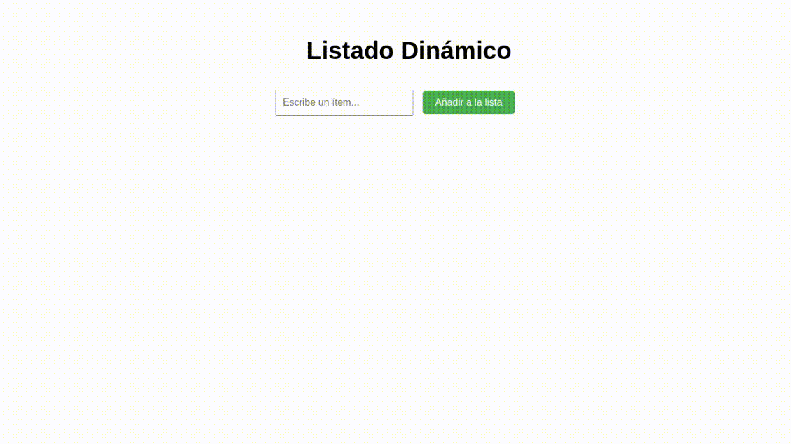
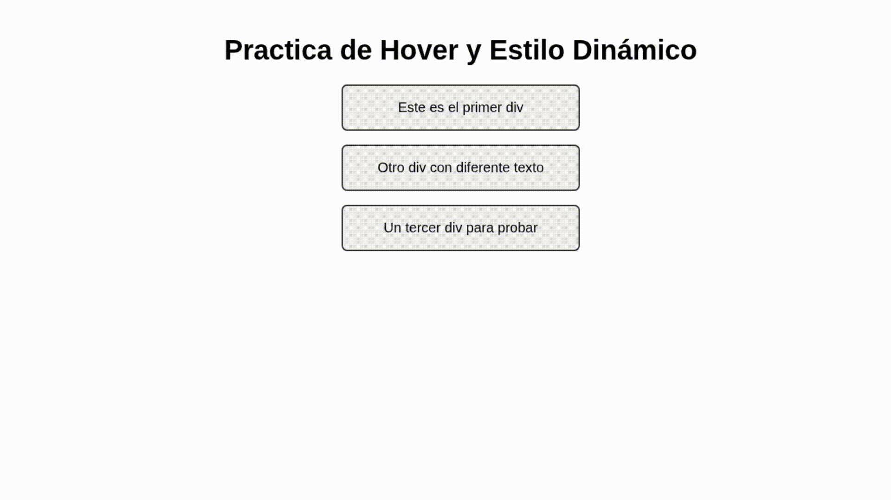
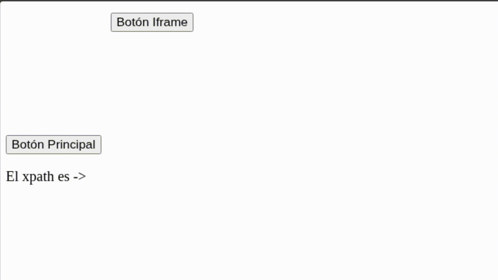

# 📚 Ejercicios de JavaScript y DOM

Este repositorio contiene cinco ejercicios prácticos que cubren diferentes aspectos del DOM, eventos y manipulación dinámica de páginas web usando JavaScript.

---

## Ejercicio 1: Cambiar color de fondo

**Descripción:**  
Una página con un botón que, al hacer clic, cambia el color de fondo a un color aleatorio generado con valores RGB.

**Archivos:**

-   `ejercicio1.html`
-   `ejercicio1.js`

**Cómo funciona:**  
Cada clic genera valores RGB aleatorios con `Math.random()` y actualiza el fondo con una transición suave.

**Demostración:**  

---

## Ejercicio 2: Calculadora de Área

**Descripción:**  
Una página con dos campos de entrada para ancho y alto de un rectángulo, y un botón que calcula y muestra el área.

**Archivos:**

-   `ejercicio2.html`
-   `ejercicio2.js`

**Cómo funciona:**  
Multiplica ancho por alto y muestra el resultado en un párrafo debajo.

**Demostración:**  

---

## Ejercicio 3: Listado Dinámico

**Descripción:**  
Un campo de texto y un botón para añadir nuevos ítems a una lista (`<ul>`), usando `createElement` y `appendChild`.

**Archivos:**

-   `ejercicio3.html`
-   `ejercicio3.js`

**Cómo funciona:**  
Cada texto ingresado se añade como un nuevo elemento `<li>` a la lista visible.

**Demostración:**  

---

## Ejercicio 4: Hover y Estilo Dinámico

**Descripción:**  
Varios `div` que cambian su color de fondo a azul y texto a blanco al pasar el ratón, y restauran sus estilos al salir.

**Archivos:**

-   `ejercicio4.html`
-   `ejercicio4.js`

**Cómo funciona:**  
Usa eventos `mouseover` y `mouseout` para cambiar dinámicamente estilos CSS.

**Demostración:**  

---

## Ejercicio 5: Detección de Clics y Generación de XPath

**Descripción:**  
Detecta clics en cualquier elemento de la página y muestra su XPath único en un párrafo de la página, incluyendo elementos dentro de un iframe.

**Archivos:**

-   `Ejercicio5.html` (no modificable)
-   `ejercicio5.js`

**Cómo funciona:**  
Escucha clics en el documento y dentro del iframe, genera XPath con la función personalizada y muestra el resultado en pantalla.

**Demostración:**  

---

## - Uso general

Para probar cualquier ejercicio:

1. Coloca los archivos `.html` y `.js` correspondientes en la misma carpeta.
2. Abre el archivo `.html` con un navegador moderno (Chrome, Firefox, Edge, etc).
3. Interactúa según las instrucciones de cada ejercicio.

---
