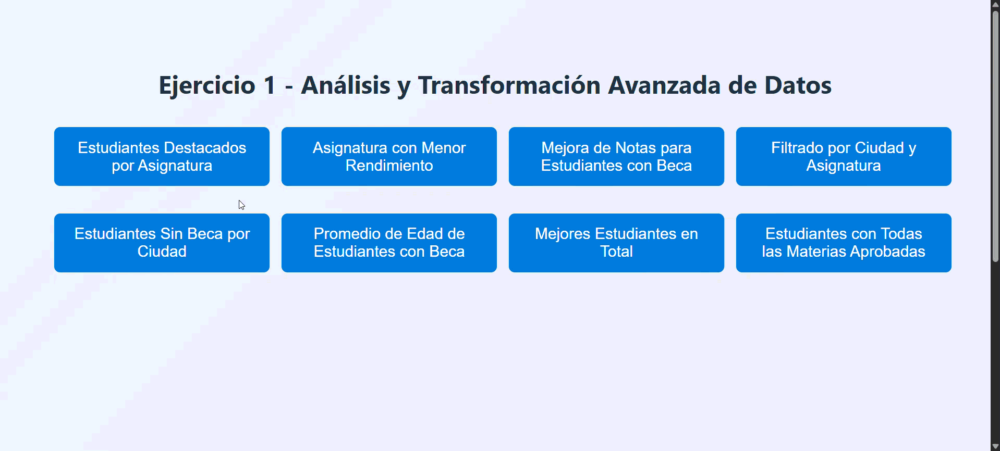

# Análisis y Transformación Avanzada de Datos

Este proyecto contiene diversas funciones en **JavaScript** diseñadas para analizar y transformar un conjunto de datos ficticio sobre estudiantes, definido en el archivo [`estudiantes.js`](./estudiantes.js).

Cada script aplica distintos criterios de filtrado, cálculo y mejora sobre los datos del conjunto.

---

## Estructura del proyecto

```
├── .
│   ├── README.md
│   ├── README_media/
│   ├── asignaturaMenorRendimiento.js
│   ├── estudiantes.js
│   ├── estudiantesAprobados.js
│   ├── estudiantesDestacadosPorAsignatura.js
│   ├── estudiantesSinBecaPorCiudad.js
│   ├── filtrarPorCiudadYAsignatura.js
│   ├── index.html
│   ├── mejoraNotasBeca.js
│   ├── mejoresEstudiantes.js
│   ├── promedioEdadEstudiantesConBeca.js
│   └── scripts/
```

---

**filtrarPorCiudadYAsignatura.js**  


**estudiantesAprobados.js**  


**promedioEdadEstudiantesConBeca.js**  


**mejoraNotasBeca.js**  


**estudiantesSinBecaPorCiudad.js**  


**mejoresEstudiantes.js**  


**asignaturaMenorRendimiento.js**  


---

## Descripción de los scripts principales

| Archivo                                 | Descripción                                                          |
| --------------------------------------- | -------------------------------------------------------------------- |
| `estudiantesAprobados.js`               | Filtra a los estudiantes que han aprobado según criterios definidos. |
| `promedioEdadEstudiantesConBeca.js`     | Calcula la edad promedio de los estudiantes con beca.                |
| `mejoraNotasBeca.js`                    | Simula la mejora de notas para estudiantes con beca.                 |
| `estudiantesSinBecaPorCiudad.js`        | Muestra los estudiantes sin beca, organizados por ciudad.            |
| `estudiantesDestacadosPorAsignatura.js` | Identifica a los estudiantes más destacados por asignatura.          |
| `mejoresEstudiantes.js`                 | Determina los mejores estudiantes según su rendimiento global.       |
| `filtrarPorCiudadYAsignatura.js`        | Permite filtrar estudiantes por ciudad y asignatura.                 |
| `asignaturaMenorRendimiento.js`         | Analiza cuál es la asignatura con peor desempeño.                    |
| `index.html`                            | Página principal de demostración del proyecto.                       |

## Uso

1. Clona este repositorio.
2. Abre `index.html` en tu navegador.
3. Revisa la consola o el DOM para visualizar los resultados generados por los scripts.

---
