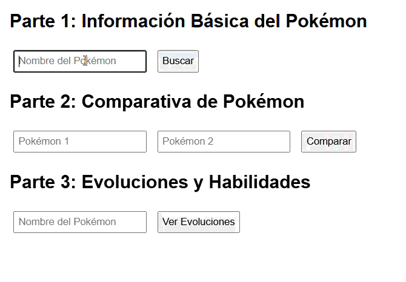
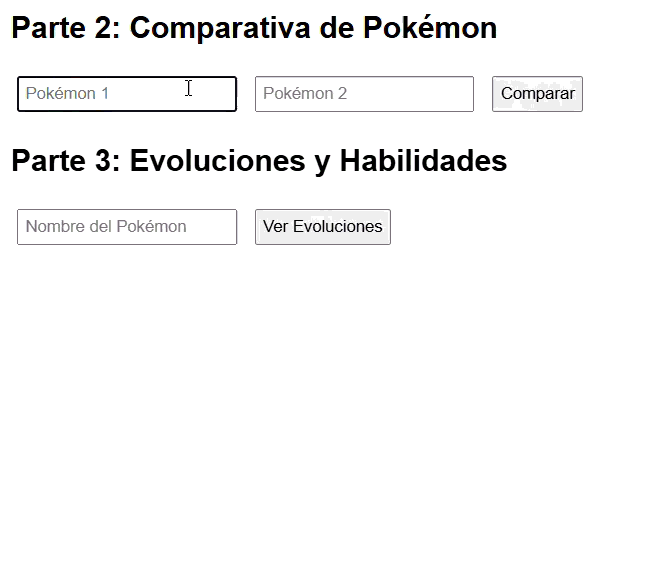

# 🐉 Aplicación PokeAPI

Este proyecto contiene diversas funciones en **JavaScript** diseñadas para analizar y transformar datos obtenidos de la **PokeAPI**, mostrando información básica, comparativas y evoluciones de diferentes Pokémon.

Cada script aplica distintos criterios de filtrado, cálculo y visualización sobre los datos obtenidos.

---

## Estructura del proyecto

```

├── .
│ ├── parte2_comparativa.js
│ ├── README.md
│ ├── index.html
│ ├── parte3_evoluciones.js
│ ├── parte1_basica.js

```

---

**parte1_basica.js**


**parte2_comparativa.js**


**parte3_evoluciones.js**


---

## Descripción de los scripts principales

| Archivo                 | Descripción                                                                                              |
| ----------------------- | -------------------------------------------------------------------------------------------------------- |
| `parte1_basica.js`      | Obtiene y muestra información básica de los Pokémon, incluyendo nombre, tipo y estadísticas principales. |
| `parte2_comparativa.js` | Realiza comparaciones entre varios Pokémon seleccionados, mostrando sus diferencias estadísticas.        |
| `parte3_evoluciones.js` | Muestra la línea evolutiva completa de un Pokémon y sus transformaciones.                                |
| `index.html`            | Página principal del proyecto donde se integran todas las funcionalidades.                               |

---

## Uso

1. Clona este repositorio.
2. Abre `index.html` en tu navegador.
3. Mira las **evoluciones**, **comparativas** y **estadísticas** de tus Pokémon favoritos usando la **PokeAPI**.

---

## Notas

- Los datos provienen de la [**PokeAPI oficial**](https://pokeapi.co/).
- Este proyecto está orientado a la **práctica de consumo de APIs y manipulación de datos con JavaScript**.
