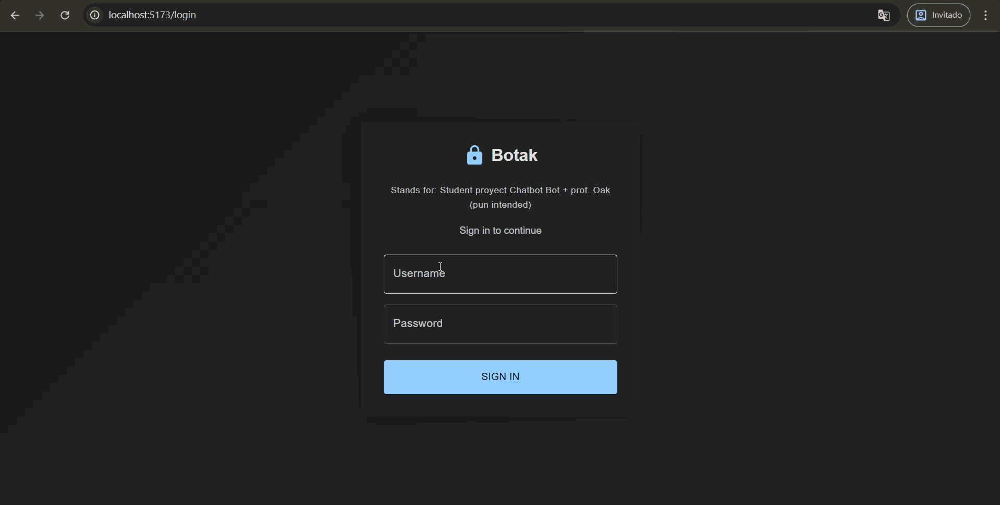
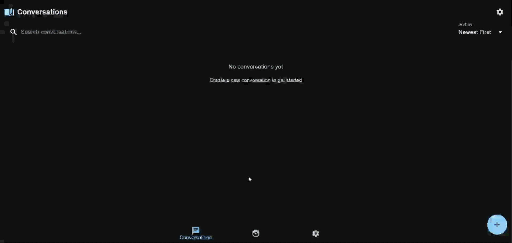
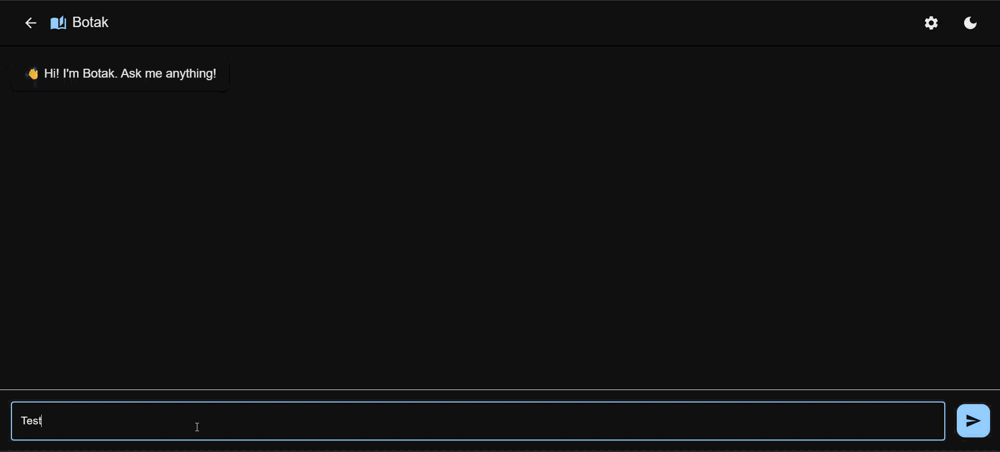
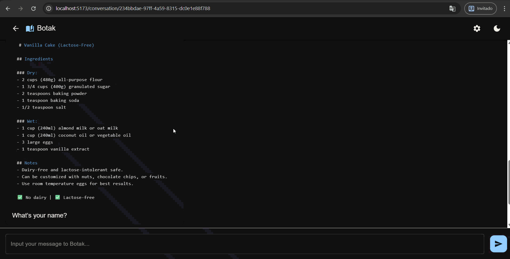
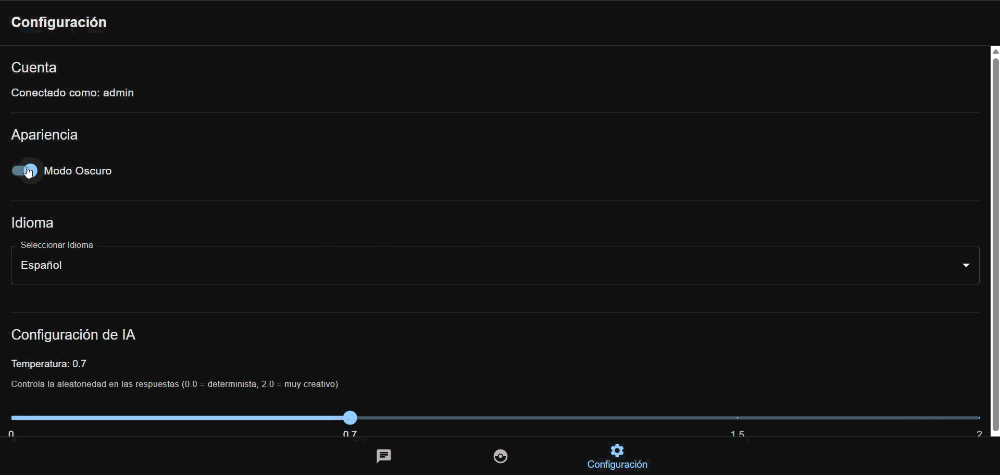
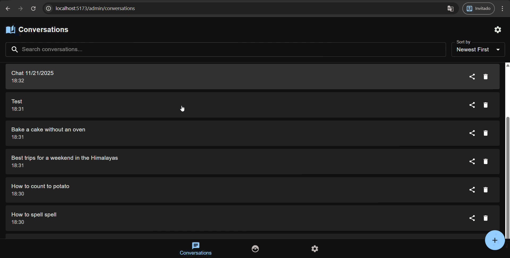
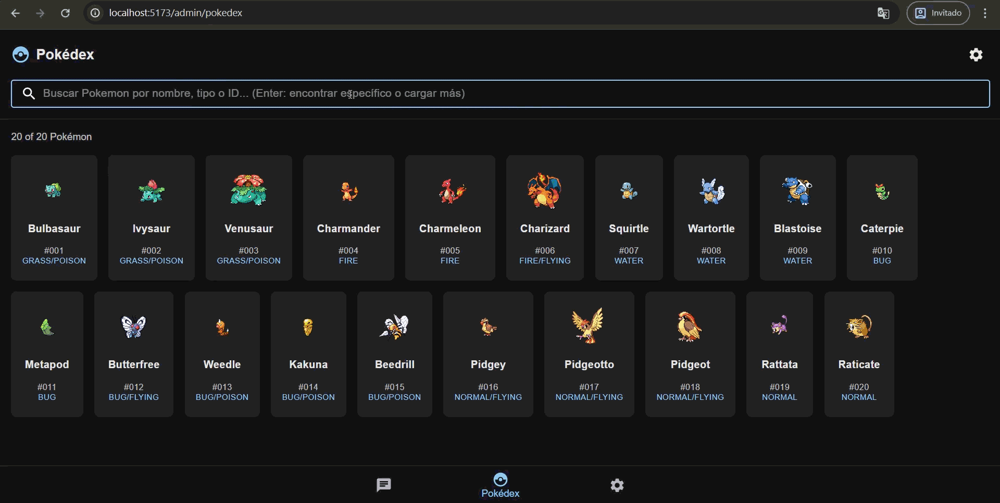
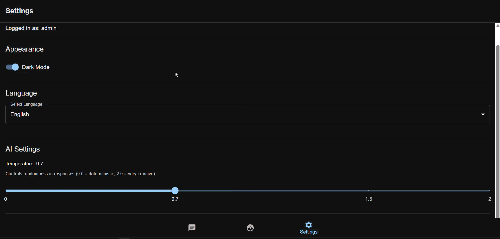
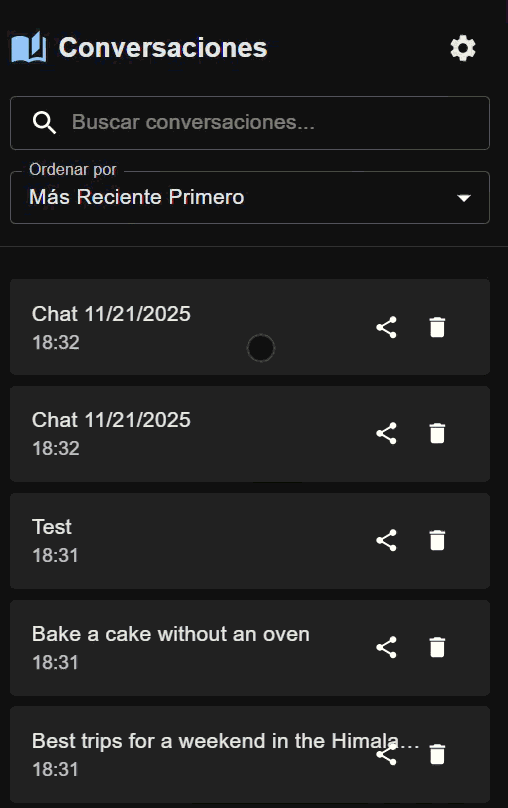

# Botak - Aplicación de Chat con IA

Una aplicación de chat conversacional con historial de conversaciones, integración de Pokédex y modelos de IA locales usando LM Studio.

## Tabla de Contenidos

-   [Características](#características)
-   [Requisitos del Sistema](#requisitos-del-sistema)
-   [Instalación](#instalación)
-   [Cómo Ejecutar](#cómo-ejecutar)
-   [Estructura del Proyecto](#estructura-del-proyecto)
-   [Funcionalidades](#funcionalidades)
-   [Solución de Problemas](#solución-de-problemas)

---

## Características

**Lo que incluye:**

-   Chat con IA usando modelos locales
-   Historial de conversaciones guardado
-   Botón para detener respuestas de IA
-   Soporte para Markdown y código con colores
-   Modo claro/oscuro
-   Inicio de sesión
-   Funciona en celulares
-   Soporte en varios idiomas
-   Información de Pokémon

---

## Requisitos del Sistema

**Necesitas tener instalado:**

-   **Node.js** 18+ y npm 9+
-   **Docker** & **Docker Compose**
-   **LM Studio** - [Descargar aquí](https://lmstudio.ai/)
-   **Git**

**Requisitos de hardware:**

-   RAM: 8GB mínimo (16GB recomendado)
-   Disco: 20GB+ para modelos de IA
-   Procesador: Multi-núcleo

---

## Instalación

### Paso 1: Descargar el código

```bash
git clone https://github.com/HernanPedraza-EC/Sprint1.5.git
cd Sprint1.5
```

## Cómo Ejecutar

### Opción 1: Script automático (Windows)

Es la forma más fácil:

```bash
./RUN_APP.bat
```

El script hará todo automáticamente:

1. Verificar que Docker está abierto
2. Instalar LM Studio (si es necesario)
3. Iniciar la base de datos
4. Iniciar el servidor
5. Abrir la aplicación

**URLs después de iniciar:**

-   Aplicación: http://localhost:5173
-   API: http://localhost:3001/api
-   Base de datos: localhost:3306

### Opción 2: Script automático (Linux/Mac)

```bash
./RUN_APP.sh
```

### Opción 3: Iniciar manualmente

**Terminal 1 - Iniciar LM Studio:**

```bash
lms server start
```

**Terminal 2 - Iniciar Docker:**

```bash
docker-compose up mariadb backend
```

**Terminal 3 - Iniciar la aplicación:**

```bash
npm run dev
```

### Opción 4: Reiniciar base de datos

Si necesitas limpiar todo:

**Windows:**

```bash
./RESET_MARIADB.bat
```

**Linux/Mac:**

```bash
./RESET_MARIADB.sh
```

---

## Estructura del Proyecto

```
Sprint1.5/
├── src/                          # Código de la aplicación
│   ├── components/
│   │   ├── Chatbot/             # Componentes del chat
│   │   │   ├── ChatWindow.jsx    # Ventana principal del chat
│   │   │   ├── MessageList.jsx   # Lista de mensajes con botón de parar
│   │   │   ├── MessageInput.jsx  # Campo de entrada
│   │   │   └── Bubbles/          # Burbujas de mensajes
│   │   ├── ChatHistory/          # Historial de conversaciones
│   │   ├── Pokedex/              # Información de Pokémon
│   │   ├── Settings/             # Configuración
│   │   ├── Auth/                 # Login
│   │   └── Layout/               # Estructura general
│   ├── services/                 # Conexión con APIs
│   │   ├── openai.js            # Conexión con LM Studio
│   │   └── conversationManager.js # Operaciones de base de datos
│   └── theme/                    # Temas (claro/oscuro)
├── backend/                       # Servidor Node.js
│   ├── server.js                # Aplicación principal
│   ├── routes/                  # Rutas de la API
│   └── scripts/                 # Scripts de base de datos
├── docker-compose.yml             # Configuración de Docker
└── .env                          # Variables de configuración
```

---

## Funcionalidades

### 1. Hacer login

-   Hacer login seguro con credenciales
    

### 2. Crear una conversación



-   Haz clic en **"Nueva Conversación"**
-   Comienza a escribir
-   Tu conversación se guarda automáticamente

---

### 3. Escribir un mensaje



-   Escribe tu mensaje
-   Presiona **Enter** o haz clic en **Enviar**
-   La IA responde automáticamente
-   Puedes usar Markdown en las respuestas

---

### 4. Historial de mensajes



-   Usa **Flecha arriba** para ver mensajes anteriores
-   Usa **Flecha abajo** para ir al siguiente
-   Útil para reutilizar preguntas

---

### 5. Cambiar tema (claro/oscuro)



-   Haz clic en el icono en la parte superior
-   Cambia entre modo claro y oscuro

---

### 6. Soporte para código y Markdown


Soporta:

-   Títulos, negritas, cursivas
-   Listas
-   Bloques de código con colores
-   Tablas

---

### 9. Historial de conversaciones



-   Ver todas tus conversaciones anteriores
-   Continuar una conversación
-   Eliminar conversaciones
-   Búsqueda rápida

---

### 9. Pokédex



-   Busca información de Pokémon
-   Ve sus estadísticas
-   Navega con facilidad

---

### 10. Configuración



-   Cambiar tema
-   Ajustar idioma
-   Controlar la creatividad de las respuestas

---

### 10. Funciona en Movil



-   La aplicación funciona perfecto en celular
-   Botones grandes y fáciles de usar
-   Navegación optimizada

---

## Solución de Problemas

### LM Studio no funciona

```bash
# Verificar si está instalado
lms --version

# Iniciar el servidor
lms server start
```

### Puerto 5173 ya está en uso

```bash
# En Windows:
netstat -ano | findstr :5173
taskkill /PID <número> /F
```

### Base de datos no inicia

```bash
# Reiniciar todo
docker-compose down
docker-compose up -d mariadb backend
```

### Error al instalar dependencias

```bash
npm cache clean --force
rm -rf node_modules package-lock.json
npm install
```

---

## Comandos Útiles

### Para desarrolladores

```bash
# Iniciar servidor de desarrollo
npm run dev

# Compilar para producción
npm run build

# Ver la versión compilada
npm run preview

# Buscar errores en el código
npm run lint
```

### Para Docker

```bash
# Ver contenedores activos
docker ps

# Ver logs (errores)
docker logs botak-backend

# Detener todo
docker-compose down
```

---

## Configuración

### Cambiar modelo de IA

La aplicación usa LM Studio. Para cambiar de modelo:

1. Abre LM Studio
2. Carga un modelo diferente
3. El servidor usará ese modelo automáticamente

### Ajustar creatividad de respuestas

En **Configuración**:

-   **Bajo (0.1-0.3):** Respuestas enfocadas y consistentes
-   **Medio (0.5-0.7):** Balanceado (por defecto)
-   **Alto (0.8-1.0):** Respuestas más creativas

---

## Tecnología Utilizada

**Frontend:**

-   React 19
-   Vite (herramienta de compilación)
-   Material-UI (componentes visuales)
-   React Router (navegación)

**Backend:**

-   Node.js + Express
-   MariaDB (base de datos)
-   LM Studio (modelos de IA)

**Última actualización:** 21 Noviembre 2025
**Proyecto:** Botak Chat Application
