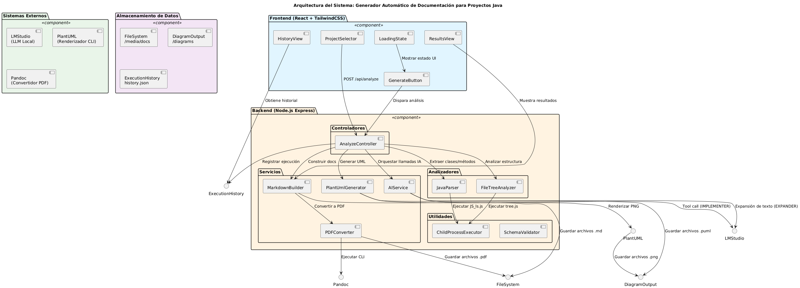
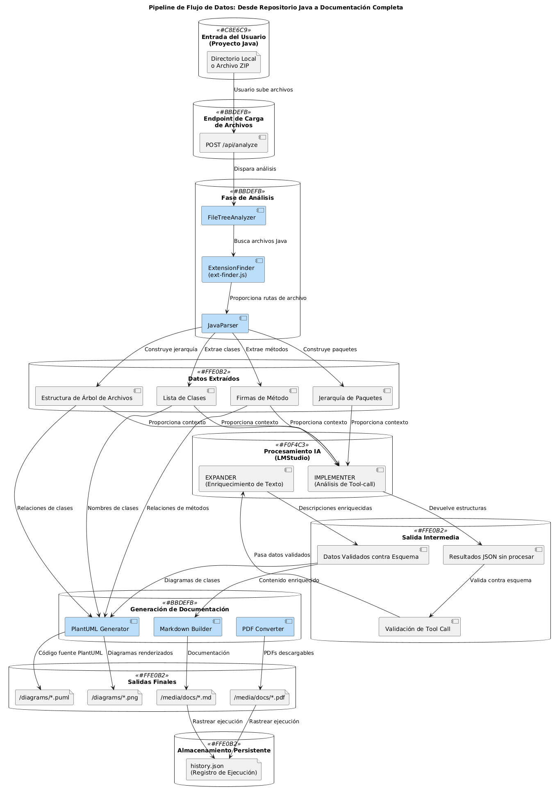
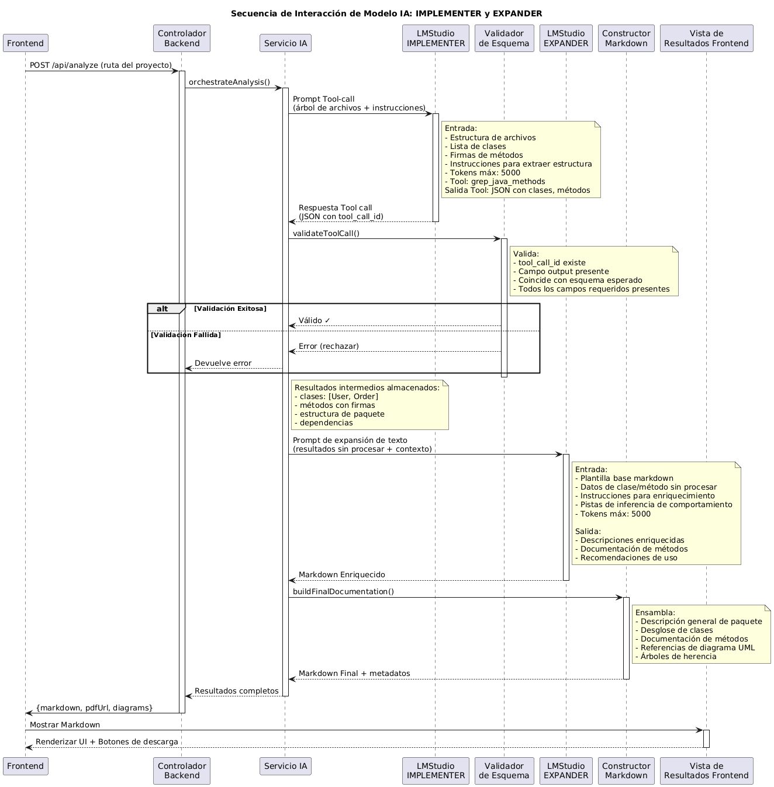
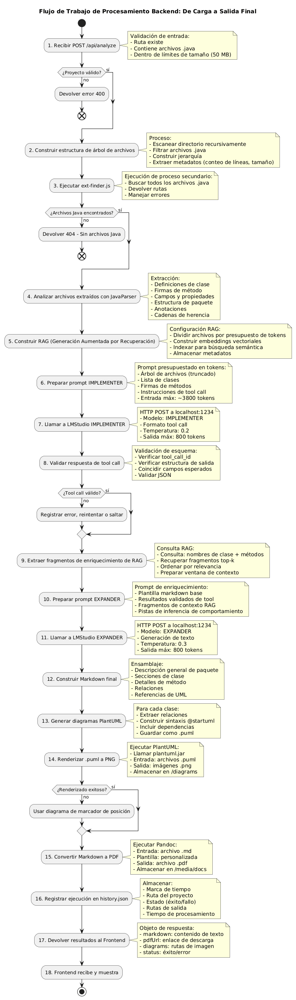
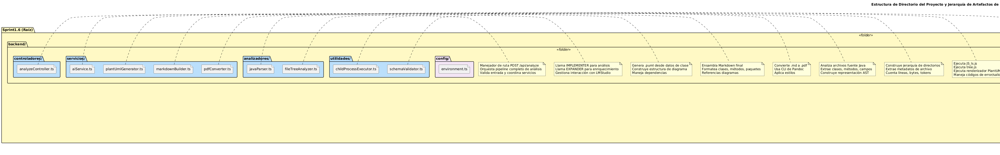
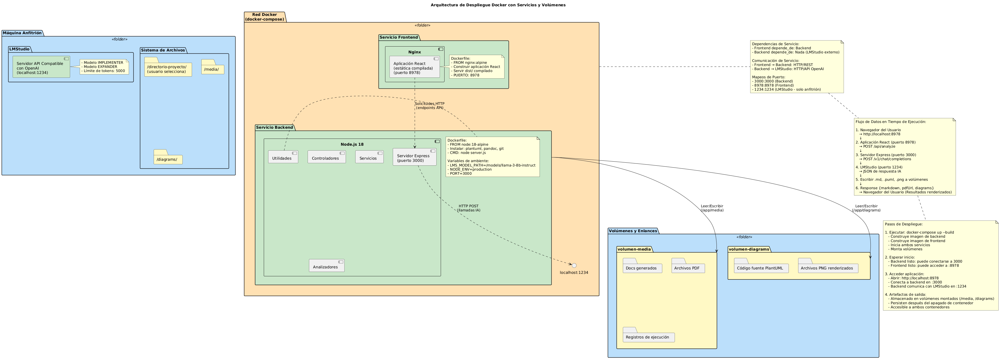
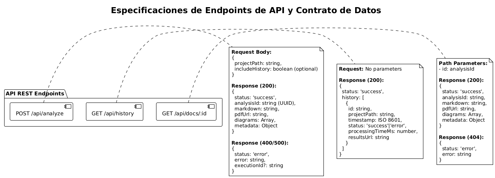

# Arquitectura Detallada del Sistema

## Descripción General

Este documento describe la arquitectura completa del Generador Automático de Documentación para Proyectos Java. El sistema proporciona una solución integral para analizar código fuente Java, generar documentación técnica enriquecida con IA, y exportar resultados a múltiples formatos.

**Filosofía Clave**: Procesamiento local que preserva la privacidad con diseño offline-first utilizando LMStudio para operaciones de IA.

---

## Componentes Principales

### Frontend (React)
- Aplicación web responsiva
- Interfaz para análisis de proyectos
- Visualización de resultados
- Gestión de historial de análisis
- Descarga de documentos generados

### Backend (Node.js/Express)
- Análisis de código Java
- Procesamiento de documentación
- Generación de diagramas PlantUML
- Conversión a PDF
- Gestión de caché
- API REST estructurada

### Servicios Externos
- **LMStudio**: Procesamiento de IA local (modelo LLM)
- **PlantUML**: Generación y renderización de diagramas
- **Pandoc**: Conversión de Markdown a PDF y otros formatos
- **Git**: Clonación de repositorios remotos

---

## Flujos de Procesamiento

### 1. Análisis de Proyecto
1. Usuario proporciona ruta local o URL de repositorio Git
2. Backend valida la entrada
3. Si es Git, clona el repositorio (clonación superficial para eficiencia)
4. Analizadores (parsers) examinan archivos Java
5. Se construye AST (Abstract Syntax Tree) de clases, métodos y campos
6. Se extraen metadatos y estructuras

### 2. Generación de Documentación
1. Se extraen clases, métodos y campos del AST
2. Se calcula estadísticas del proyecto (conteos, métricas)
3. Se genera Markdown base con estructuras
4. Se enriquece con IA (descripciones automáticas, insights)
5. Se generan diagramas PlantUML (arquitectura, flujos, componentes)
6. Se renderiza todo a PNG

### 3. Exportación
1. Se renderiza Markdown a PDF usando Pandoc
2. Se almacenan resultados en caché para acceso rápido
3. Se retornan URLs descargables
4. Se registra en historial de análisis

---

## Arquitectura General

El sistema sigue una arquitectura en capas con los siguientes componentes principales y sus interconexiones:
- **Capas**: Cliente, API Gateway, Lógica de Negocio, Almacenamiento
- **Componentes internos**: Controladores, Servicios, Utilidades
- **Integraciones externas**: LMStudio, PlantUML, Pandoc, Git

Fuente: [01-system-architecture-diagram.puml](./Diagrams/01-system-architecture-diagram.puml)

---

## Flujos de Datos

### Pipeline de Procesamiento Completo

El flujo de datos desde el repositorio Java hasta la documentación completa:
- Entrada: Ruta de proyecto o URL Git
- Procesamiento: Análisis, enriquecimiento, generación de diagramas
- Salida: Markdown, PDF, diagramas PNG

Fuente: [02-data-flow-pipeline.puml](./Diagrams/02-data-flow-pipeline.puml)

### Secuencia de Interacción con IA

Cómo el frontend interactúa con el backend y cómo el backend utiliza IA:
- Usuario → Frontend → Backend
- Backend → LMStudio (IA local)
- Procesamiento en paralelo: parsing, IA, generación de diagramas
- Retorno de resultados complejos

Fuente: [03-ai-interaction-sequence.puml](./Diagrams/03-ai-interaction-sequence.puml)

### Backend - Pipeline de Procesamiento

Pasos internos del backend:
1. Recepción y validación de solicitud
2. Clonación (si aplica)
3. Análisis de archivos Java
4. Generación de Markdown
5. Enriquecimiento con IA
6. Generación de diagramas
7. Conversión a PDF
8. Almacenamiento en caché

Fuente: [04-backend-workflow-process.puml](./Diagrams/04-backend-workflow-process.puml)

---

## Estructura de Archivos y Directorios

Jerarquía de archivos del proyecto y ubicación de artefactos generados:
- `./Docs/` - Documentación del proyecto
- `./Docs/Diagrams/` - Definiciones PlantUML
- `./Docs/Diagrams/Generated/` - Diagramas PNG generados
- `./media/` - Documentos PDF generados
- `./logs/` - Registros de ejecución

Fuente: [06-file-structure-and-hierarchy.puml](./Diagrams/06-file-structure-and-hierarchy.puml)

---

## Arquitectura de Despliegue

Descripción del despliegue con Docker Compose - cada etapa en su propio contenedor:

Fuente: [07-deployment-architecture.puml](./Diagrams/07-deployment-architecture.puml)

### Contenedores Principales
- **Frontend Container**: React en puerto 8978
  - Interfaz web responsiva
  - Comunicación con backend API

- **Backend Container**: Express en puerto 3000
  - Orquestación de análisis
  - Validación de entrada
  - Gestión de caché
  - Enrutamiento de solicitudes

### Contenedores del Pipeline de Generación
Cada etapa del pipeline de generación corre en su propio contenedor:

- **Markdown Generation Container**: Servicio especializado
  - Análisis de archivos Java (AST)
  - Generación de Markdown base
  - Enriquecimiento con IMPLEMENTER (estructura y metadata)
  - Enriquecimiento con EXPANDER (descripciones, embeddings, conceptos)

- **Diagram Generation Container**: PlantUML en puerto 8080
  - Renderización de diagramas
  - Conversión PlantUML → PNG
  - Caché de diagramas

- **PDF Generation Container**: Pandoc en puerto 3001
  - Conversión de Markdown a PDF
  - Procesamiento de LaTeX
  - Generación de tabla de contenidos
  - Formateo final

### Servicios Externos
- **LMStudio** (puerto 1234): IA local para IMPLEMENTER y EXPANDER
- **Git CLI**: Clonación de repositorios

### Volúmenes Compartidos
- `./media`: Documentos PDF generados (persistencia entre contenedores)
- `./diagrams`: Archivos PlantUML y PNG generados (persistencia entre contenedores)
- `./logs`: Registros de ejecución (persistencia)

---

## Especificaciones de API

Detalla los endpoints REST disponibles:

Fuente: [08-api-endpoint-schema.puml](./Diagrams/08-api-endpoint-schema.puml)

### POST /api/analyze
- **Entrada**: Ruta de proyecto o URL de Git
- **Salida**: Markdown, URLs de PDF, diagramas, metadatos
- **Tiempo**: 1-5 minutos para proyectos grandes

### GET /api/history
- **Entrada**: Ningún parámetro
- **Salida**: Lista de análisis anteriores

### GET /api/docs/:id
- **Entrada**: ID de análisis previo
- **Salida**: Resultados almacenados en caché

---

## Modelos de Datos

### Entrada
- **ProjectPath**: Ruta local o URL de repositorio Git
- **Validación**: Detección automática de tipo (local vs remoto)

### Procesamiento Interno
- **JavaClass**: Nombre, paquete, métodos, campos, herencia
- **MethodInfo**: Firma, parámetros, tipo de retorno
- **FieldInfo**: Tipo, visibilidad, modificadores

### Salida
- **AnalysisResult**: Status, markdown, pdfUrl, diagrams, metadata
- **Diagrams**: Nombre, URL PNG, tipo (class/sequence/deployment)
- **Metadata**: Conteo de clases, métodos, paquetes, líneas de código

---

## Flujo de Enriquecimiento con IA

El sistema utiliza dos patrones de IA:

### IMPLEMENTER Pattern
- Extrae estructura técnica del código
- Identifica clases, métodos, dependencias
- Genera descripciones iniciales

### EXPANDER Pattern
- Enriquece descripciones iniciales
- Genera insights y recomendaciones
- Mejora calidad de documentación

Ambos utilizan LMStudio (procesamiento local, sin datos en la nube).

---

## Optimizaciones y Rendimiento

### Eficiencia de Recursos
- **Clonación superficial (git shallow)**: Reduce tiempo y espacio en 80-95%
- **Caché inteligente**: Evita reprocesamiento de análisis idénticos
- **Procesamiento paralelo**: Parsing, IA y generación de diagramas ejecutan en paralelo

### Gestión de Contexto IA
- **Embeddings dinámicos**: Generados por EXPANDER para abstraer conceptos generales del codebase
- **Token Window constraints**: Modelos operan dentro de límites de ventana de tokens
- **Contexto dinámico**: Se refresca automáticamente en cada generación de documento
- **Dos modelos en paralelo**:
  - **IMPLEMENTER**: Extracción de estructura técnica (CPU)
  - **EXPANDER**: Enriquecimiento de descripciones, generación de embeddings y abstracción de conceptos (GPU)
### Límites y Escalabilidad
- **Tamaño máximo de proyecto**: 50MB
- **Timeout de solicitud HTTP**: 2 minutos con reintentos automáticos
- **Reintentos**: Backoff exponencial para fallos transitorios

---

## Seguridad y Privacidad

- **Procesamiento local**: Todo ocurre en máquina del usuario
- **Sin datos remotos**: LMStudio corre localmente, no se envía código a servidores
- **Limpieza automática**: Repositorios clonados se eliminan después del análisis
- **Isolación**: Docker proporciona separación entre servicios

---

## Manejo de Errores

- **Validación de entrada**: Ruta existe, contiene Java, tamaño válido
- **Reintentos**: Backoff exponencial para fallos transitorios
- **Logs detallados**: Errores registrados con contexto
- **Respuestas estructuradas**: Status, código de error, mensaje descriptivo

---

## Requisitos de Frontend (Conforme con ASSIGNMENT)

### State Management
- `useState` para projectPath, analysisStatus, results, errors, analysisHistory
- Props drilling y lifting state up entre componentes
- Manejo de estado global opcional con Context API

### Event Handling
- `onClick` en botón "Generar Documentación"
- `onChange` en campo de entrada de proyecto
- `onSubmit` en formulario de análisis

### React Hooks
- `useEffect` para cargar historial al montar componente
- `useEffect` para responder a cambios de estado
- Rendering condicional para estados loading, error, success

### Estructura de Componentes
- ProjectSelector, AnalysisForm, ResultsViewer, HistoryPanel, ErrorBoundary

---

## Requisitos de Backend (Conforme con ASSIGNMENT)

### Endpoints Implementados
- `POST /api/analyze` - Análisis de proyecto Java
- `GET /api/history` - Historial de análisis
- `GET /api/docs/:id` - Descarga de PDF/Markdown

### Estructura de Módulos
- `/backend/src/analyzers/` - Parseo de código Java
- `/backend/src/generators/` - Generación PlantUML
- `/backend/src/services/` - Integración LMStudio
- `/backend/src/controllers/` - Manejo de endpoints

---

## Mejoras Implementadas (Beyond Requirements)

Ver detalles en [MEJORAS_DETALLADAS.md](./MEJORAS_DETALLADAS.md):
- Estadísticas y análisis avanzados
- Filtrado granular y búsqueda RAG
- Insights IA (patrones, recomendaciones)
- Validación robusta de esquemas
- Accesibilidad y diseño responsive
- 7 tipos de diagramas avanzados
- Integración completa de herramientas
- Privacidad offline-first
- Configuración modular
- Testing y documentación

---

## Siguiente Pasos

Para configurar y ejecutar el sistema, ver [GUÍA_RÁPIDA.md](../GUÍA_RÁPIDA.md)

Para detalles de dependencias, ver [PILA_TECNOLÓGICA.md](../PILA_TECNOLÓGICA.md)

Para especificaciones de API, ver [REFERENCIA_API.md](../REFERENCIA_API.md)

Para verificar cumplimiento, ver [CUMPLIMIENTO_REQUISITOS.md](./CUMPLIMIENTO_REQUISITOS.md)
