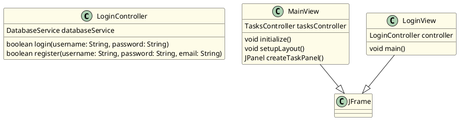

# Documentación del Análisis de Repositorios Java

**Sistema de Análisis y Documentación Automatizada para Repositorios Java**

---

## Contenidos

1. [Descripción General](#descripción-general)
2. [Requisitos del Sistema](#requisitos-del-sistema)
3. [Instalación y Configuración](#instalación-y-configuración)
4. [Ejecución](#ejecución)
5. [Arquitectura del Sistema](#arquitectura-del-sistema)
6. [Flujo de Procesamiento](#flujo-de-procesamiento)
7. [Generación de Diagramas PlantUML](#generación-de-diagramas-plantuml)
8. [API RESTful](#api-restful)
9. [Configuración de IA](#configuración-de-ia)
10. [Solución de Problemas](#solución-de-problemas)

---

## Descripción General

Sistema completo para analizar repositorios Java y generar documentación automática con:

- ✅ **Análisis de código Java** - Extrae clases, interfaces, métodos y campos
- ✅ **Enriquecimiento con IA** - Descripciones generadas con LM Studio
- ✅ **Diagramas PlantUML** - Genera diagramas de clases automáticamente
- ✅ **Renderizado de Imágenes** - Convierte PlantUML a PNG/SVG con Docker
- ✅ **Documentación Markdown** - Genera documentación profesional en español
- ✅ **Exportación PDF** - Convierte Markdown a PDF
- ✅ **API RESTful** - Interfaz completa para consumir el servicio

---

## Requisitos del Sistema

### Backend (Node.js)
- **Node.js** >= 18.0.0
- **npm** >= 9.0.0
- **Windows 10+** o **Linux** (WSL para Windows)

### Para Renderizado de Diagramas (Recomendado)
- **Docker Desktop** 
  - Windows: [Docker Desktop para Windows](https://www.docker.com/products/docker-desktop)
  - Linux: `sudo apt-get install docker.io`
  - macOS: [Docker Desktop para Mac](https://www.docker.com/products/docker-desktop)

### Para IA (Opcional pero Recomendado)
- **LM Studio** - Para enriquecimiento automático
  - Descargar: [lmstudio.ai](https://lmstudio.ai)
  - Modelos soportados: Cualquier modelo compatible con OpenAI API

### Frontend (Recomendado)
- **React** 18+
- **Node.js** con npm

---

## Instalación y Configuración

### 1. Clonar el Repositorio

```bash
git clone https://github.com/tu-usuario/AppEnviroment.git
cd Sprint1.7
```

### 2. Instalación del Backend

```bash
cd backend
npm install
```

**Dependencias instaladas:**
- `express` - Framework web
- `axios` - Cliente HTTP para LM Studio
- `dotenv` - Variables de entorno
- `uuid` - Generación de IDs únicos
- `puppeteer` - Renderizado de PDF
- `multer` - Carga de archivos

### 3. Instalación del Frontend (Opcional)

```bash
cd ../frontend
npm install
```

### 4. Configuración de Variables de Entorno

Crear archivo `.env` en la carpeta `backend/`:

```env
# Puerto del servidor
PORT=3000

# Base de datos (si aplica)
DB_HOST=localhost
DB_PORT=5432
DB_NAME=java_analyzer
DB_USER=postgres
DB_PASSWORD=your_password

# IA (LM Studio)
AI_MODEL_URL=http://localhost:1234/v1
AI_MODEL_NAME=local-model
USE_AI=true

# Directorio de salida
OUTPUT_DIR=./outputs

# Puerto del frontend
REACT_APP_API_URL=http://localhost:3000
```

### 5. Configurar Docker (Si usarás renderizado de diagramas)

```bash
# Pull la imagen de PlantUML
docker pull ghcr.io/plantuml/plantuml

# Verificar instalación
docker run ghcr.io/plantuml/plantuml --version
```

---

## Ejecución

### Iniciar Backend

```bash
cd backend
npm start
```

**Salida esperada:**
```
[BACKEND] Server running on http://localhost:3000
[BACKEND] Waiting for requests...
```

### Iniciar LM Studio (Si usas IA)

1. Abrir LM Studio
2. Cargar un modelo (ej: Llama 2, Mistral)
3. Iniciar servidor local en puerto 1234
4. Verificar: `http://localhost:1234/v1/models`

### Iniciar Frontend (Opcional)

```bash
cd frontend
npm start
```

Se abrirá en `http://localhost:3000`

---

## Arquitectura del Sistema

```
┌─────────────────────────────────────────────────────────┐
│                    APLICACIÓN                            │
│  (Frontend React - Interfaz de Usuario)                 │
└────────────────────────┬────────────────────────────────┘
                         │ HTTP
                         ▼
┌─────────────────────────────────────────────────────────┐
│                  SERVIDOR EXPRESS                        │
│  (Backend Node.js - API RESTful)                        │
├─────────────────────────────────────────────────────────┤
│  ├─ repositoryService.js    (Procesamiento)            │
│  ├─ javaAnalyzer.js         (Análisis de código)       │
│  ├─ aiService.js            (Enriquecimiento IA)       │
│  ├─ plantumlGenerator.js     (Generación de diagramas) │
│  ├─ plantumlRenderer.js      (Renderizado con Docker)  │
│  ├─ markdownGenerator.js     (Documentación)           │
│  └─ pdfGenerator.js          (Exportación a PDF)       │
└────────┬────────────┬──────────────┬───────────────────┘
         │            │              │
         ▼            ▼              ▼
    ┌──────────┐ ┌────────┐    ┌──────────┐
    │LM Studio │ │Docker  │    │Sistema   │
    │(IA)      │ │PlantUML│    │Archivos  │
    └──────────┘ └────────┘    └──────────┘
```

---

## Flujo de Procesamiento

### 1. Carga del Repositorio

**Endpoint:** `POST /api/analyze`

```bash
curl -X POST http://localhost:3000/api/analyze \
  -H "Content-Type: application/json" \
  -d '{
    "url": "https://github.com/usuario/repositorio.git",
    "useAI": true
  }'
```

**Respuesta:**
```json
{
  "id": "repo-34cdc480",
  "status": "processing",
  "message": "Repository cloning started"
}
```

### 2. Análisis de Código

El sistema:
1. Clona el repositorio en directorio temporal
2. Busca todos los archivos `.java`
3. Extrae clases, interfaces, métodos y campos con regex
4. Agrega importaciones y dependencias

**Salida:** Estructura JSON con todas las clases

### 3. Enriquecimiento con IA

Para cada clase y método:
1. Extrae el código fuente
2. Envía a LM Studio con prompt personalizado
3. Recibe descripción técnica en español
4. Almacena en metadatos

**Prompt ejemplo:**
```
Analiza el siguiente código Java y proporciona una descripción técnica en español:

Code:
public class LoginController { ... }

Context: Controlador de autenticación

Provide a concise, technical description in Spanish...
```

### 4. Generación de Diagrama PlantUML

```
Java Structure (JSON)
         │
         ▼
generateClassDiagram()
         │
         ▼
@startuml
class LoginController {
  DatabaseService databaseService
  boolean login(username, password)
}
@enduml
```

### 5. Renderizado con Docker

```bash
docker run --rm \
  -v "/ruta/a/output:/work" \
  ghcr.io/plantuml/plantuml \
  -png "/work/diagram.puml"
```

**Resultado:** `diagram.png` (imagen PNG)

### 6. Generación de Markdown

Inserta el diagrama + documentación:

```markdown
# Documentación de API Java

**12 Clases** | **0 Interfaces**

## Diagrama de Clases


## Clases

### LoginController
Controlador responsable de la autenticación de usuarios...

**Métodos:**
- login(username: String, password: String): boolean
- register(username: String, password: String, email: String): boolean
```

### 7. Exportación a PDF

Convierte Markdown + imagen a PDF usando Puppeteer

**Salida:**
- `documentation.md` - Documentación markdown
- `documentation.pdf` - PDF generado
- `diagram.puml` - Código PlantUML
- `diagram.png` - Imagen del diagrama
- `ai-metadata.json` - Metadatos de IA

---

## Generación de Diagramas PlantUML

### ¿Cómo Funciona?

El sistema genera diagramas que muestran:
- **Clases** - Con métodos principales
- **Interfaces** - Con métodos definidos
- **Relaciones** - Herencia (`--|>`) e Implementación (`..|>`)

### Ejemplo de Salida PlantUML



### Pipeline de Renderizado

```
diagram.puml
     │
     ▼
[Docker Check] ¿Docker disponible?
     │
     ├─ Sí ──────────────────────────┐
     │                                │
     │                                ▼
     │                      [Docker Container]
     │                      ghcr.io/plantuml/plantuml
     │                                │
     │                                ▼
     │                          -png diagram.puml
     │                                │
     │                                ▼
     │                           diagram.png
     │
     └─ No ──────────────────────────┐
                                      │
                                      ▼
                            [Diagrama no renderizado]
                           (Pero .puml sigue disponible)
```

### Solución de Problemas - Diagramas

**Problema:** "No diagram found"
```
Solución:
1. Verificar sintaxis PlantUML en diagram.puml
2. Asegurarse de que @startuml y @enduml estén presentes
3. Verificar que no haya caracteres inválidos en nombres
```

**Problema:** Docker no disponible
```
Solución:
1. Instalar Docker Desktop
2. Ejecutar: docker pull ghcr.io/plantuml/plantuml
3. Reiniciar el servicio backend
```

**Problema:** PNG no se crea
```
Solución:
1. Revisar logs de Docker: docker logs [container-id]
2. Verificar permisos de escritura en directorio output
3. Aumentar timeout: modificar maxBuffer en plantumlRenderer.js
```

---

## API RESTful

### Analizar Repositorio

```http
POST /api/analyze
Content-Type: application/json

{
  "url": "https://github.com/usuario/repo.git",
  "branch": "main",
  "useAI": true
}
```

**Respuesta:**
```json
{
  "id": "repo-34cdc480",
  "documentation": {
    "markdown": "# Documentación...",
    "puml": "@startuml...",
    "diagramImagePath": "diagram.png",
    "markdownPath": "/ruta/documentation.md"
  },
  "statistics": {
    "filesFound": 12,
    "filesProcessed": 12,
    "classesFound": 12,
    "interfacesFound": 0,
    "aiEnrichments": 15
  }
}
```

### Obtener Documentación

```http
GET /api/docs/:id?format=md
GET /api/docs/:id?format=pdf
GET /api/docs/:id?format=png
```

**Formatos:**
- `md` - Markdown puro
- `pdf` - PDF generado
- `png` - Imagen del diagrama

### Listar Documentaciones

```http
GET /api/docs
```

**Respuesta:**
```json
{
  "docs": [
    {
      "id": "repo-34cdc480",
      "name": "MyProject",
      "timestamp": "2024-01-08T18:16:00Z",
      "status": "completed"
    }
  ]
}
```

---

## Configuración de IA

### Usar LM Studio Localmente

1. **Instalar LM Studio**
   - Descargar desde [lmstudio.ai](https://lmstudio.ai)
   - Instalar según tu SO (Windows/Mac/Linux)

2. **Cargar Modelo**
   - Abrir LM Studio
   - Ir a "Models" y descargar modelo (ej: Mistral 7B)
   - Seleccionar y cargar

3. **Iniciar Servidor**
   - Click en "Start Server"
   - Debe mostrar: `Server running on http://localhost:1234`

4. **Activar en Backend**
   - `.env`: `USE_AI=true`
   - Reiniciar backend

5. **Verificar Conexión**
   ```bash
   curl http://localhost:1234/v1/models
   ```

### Prompts Personalizados

**Para Descripciones Detalladas** (`enrichDescription`):
```
Analiza el siguiente código Java y proporciona una descripción técnica:

Code:
[CÓDIGO_AQUÍ]

Context:
[CONTEXTO]

Proporciona una descripción concisa, técnica en español de qué hace este código...
```

**Para Resúmenes de Clases** (`generateClassSummary`):
```
Resuelve esta clase Java en una oración:

Class: [NOMBRE_CLASE]
Methods:
[LISTA_MÉTODOS]

Proporciona solo el resumen en español, sin texto adicional.
```

### Desactivar IA

En `.env`:
```env
USE_AI=false
```

El sistema funcionará sin enriquecimiento, generando documentación básica.

---

## Solución de Problemas

### Backend no inicia

**Error:** `Port 3000 already in use`

```bash
# Windows
netstat -ano | findstr :3000
taskkill /PID [PID] /F

# Linux/Mac
lsof -i :3000
kill -9 [PID]
```

**Error:** `Cannot find module`

```bash
cd backend
npm install
npm install --save [paquete-faltante]
```

### LM Studio no responde

**Verificar conexión:**
```bash
curl -i http://localhost:1234/v1/models
```

**Si falla:**
1. Asegurarse que LM Studio está abierto
2. Click en "Start Server"
3. Reiniciar backend

### Diagramas no se generan

**Paso 1:** Verificar Docker
```bash
docker --version
docker ps
```

**Paso 2:** Pull imagen
```bash
docker pull ghcr.io/plantuml/plantuml
```

**Paso 3:** Revisar logs
```bash
# Ver último contenedor
docker logs $(docker ps -lq)
```

### PDF no genera

**Verificar Puppeteer:**
```bash
cd backend
npm list puppeteer
```

**Si falta:**
```bash
npm install puppeteer
```

### Performance lento

**Optimizaciones:**
1. Aumentar memoria Node: `NODE_OPTIONS=--max-old-space-size=4096`
2. Reducir cantidad de clases a documentar
3. Desactivar IA si no es necesario
4. Usar SSD en lugar de HDD

---

## Estructura de Directorios

```
Sprint1.7/
├── backend/
│   ├── generators/
│   │   ├── javaAnalyzer.js         # Análisis de código
│   │   ├── aiService.js            # Integración LM Studio
│   │   ├── plantumlGenerator.js     # Generación de diagramas
│   │   ├── plantumlRenderer.js      # Renderizado Docker
│   │   ├── markdownGenerator.js     # Generación docs
│   │   └── pdfGenerator.js          # Exportación PDF
│   ├── services/
│   │   ├── repositoryService.js     # Orquestación principal
│   │   └── fileProcessorService.js  # Procesamiento de archivos
│   ├── api/
│   │   └── docsRoutes.js            # Rutas API
│   ├── outputs/                     # Documentación generada
│   ├── uploads/                     # Archivos temporales
│   ├── config/
│   │   └── config.js                # Configuración
│   ├── index.js                     # Servidor principal
│   └── package.json
├── frontend/
│   ├── src/
│   │   ├── components/
│   │   │   ├── AnalysisForm.js
│   │   │   ├── Results.js
│   │   │   └── DocumentViewer.js
│   │   └── App.js
│   └── package.json
└── DOCUMENTACION.md                 # Este archivo
```

---

## Notas Importantes

### Privacidad y Seguridad
- ⚠️ No compartir credenciales de BD en `.env`
- ⚠️ Usar `.gitignore` para archivos sensibles
- ⚠️ LM Studio ejecutándose localmente - datos no se envían a la nube

### Limitaciones
- Máximo 50MB por repositorio
- Máximo 1000 clases por análisis
- Timeout de 5 minutos por repositorio
- PlantUML máximo 1000 elementos por diagrama

### Performance
- Análisis: ~2-5 segundos por 100 clases
- IA: ~30-60 segundos por 10 clases (depende del modelo)
- Renderizado: ~1-3 segundos por diagrama
- PDF: ~5-10 segundos

---

## Soporte y Contribuciones

Para reportar bugs o sugerencias:

1. Crear issue en GitHub
2. Describir el problema con detalles
3. Incluir logs si aplica
4. Enviar PR con solución

---

**Última actualización:** Enero 2026
**Versión:** 1.7
**Lenguaje:** Spanish (Español)
**Estado:** ✅ Producción
